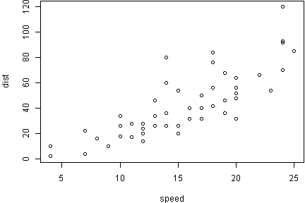
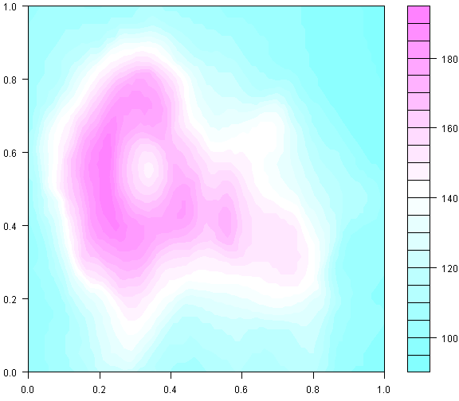



The [knitr](http://yihui.name/knitr/) package provides an easy way to embed 
[R](http://www.r-project.org/) code in a [Jekyll-Bootstrap](http://jekyllbootstrap.com/) 
blog post. The only required input is an **R Markdown** source file. 
The name of the source file used to generate this post is *2012-07-03-knitr-jekyll.Rmd*, available
[here](https://github.com/jfisher-usgs/jfisher-usgs.github.com/blob/master/Rmd/2012-07-03-knitr-jekyll.Rmd).
Steps taken to build this post are as follows:

### Step 1

Create a Jekyll-Boostrap blog if you don't already have one. But I do!
A brief tutorial on building this blog is available 
[here](/lessons/2012/05/30/jekyll-build-on-windows/).

### Step 2

Open the R Console and process the source file:

```r
KnitPost <- function(input, base.url = "/") {
    require(knitr)
    opts_knit$set(base.url = base.url)
    fig.path <- paste0("figs/", sub(".Rmd$", "", basename(input)), "/")
    opts_chunk$set(fig.path = fig.path)
    opts_chunk$set(fig.cap = "center")
    render_jekyll()
    knit(input, envir = parent.frame())
}
KnitPost("2012-07-03-knitr-jekyll.Rmd")
```


### Step 3

Move the resulting image folder *2012-07-03-knitr-jekyll* and **Markdown** file 
*2012-07-03-knitr-jekyll.md* to the local 
*jfisher-usgs.github.com* [git](http://git-scm.com/) repository.
The KnitPost function assumes that the image folder will be placed in a 
[figs](https://github.com/jfisher-usgs/jfisher-usgs.github.com/tree/master/figs) 
folder located at the root of the repository.

### Step 4

Add the following CSS code to the 
*/assets/themes/twitter-2.0/css/bootstrap.min.css* file to center images:

    [alt=center] {
      display: block;
      margin: auto;
    }

That's it.

***

Here are a few examples of embedding R code:

```r
summary(cars)
```

```
##      speed           dist    
##  Min.   : 4.0   Min.   :  2  
##  1st Qu.:12.0   1st Qu.: 26  
##  Median :15.0   Median : 36  
##  Mean   :15.4   Mean   : 43  
##  3rd Qu.:19.0   3rd Qu.: 56  
##  Max.   :25.0   Max.   :120
```


```r
par(mar = c(4, 4, 0.1, 0.1), omi = c(0, 0, 0, 0))
plot(cars)
```

 

##### Figure 1: Caption


```r
par(mar = c(2.5, 2.5, 0.5, 0.1), omi = c(0, 0, 0, 0))
filled.contour(volcano)
```

 

##### Figure 2: Caption

And don't forget your session information for proper reproducible research.

```r
sessionInfo()
```

```
## R version 2.15.1 (2012-06-22)
## Platform: x86_64-pc-mingw32/x64 (64-bit)
## 
## locale:
## [1] LC_COLLATE=English_United States.1252 
## [2] LC_CTYPE=English_United States.1252   
## [3] LC_MONETARY=English_United States.1252
## [4] LC_NUMERIC=C                          
## [5] LC_TIME=English_United States.1252    
## 
## attached base packages:
## [1] stats     graphics  grDevices utils     datasets  methods   base     
## 
## other attached packages:
## [1] knitr_0.8
## 
## loaded via a namespace (and not attached):
## [1] digest_0.5.2   evaluate_0.4.2 formatR_0.6    plyr_1.7.1    
## [5] stringr_0.6.1  tools_2.15.1
```

